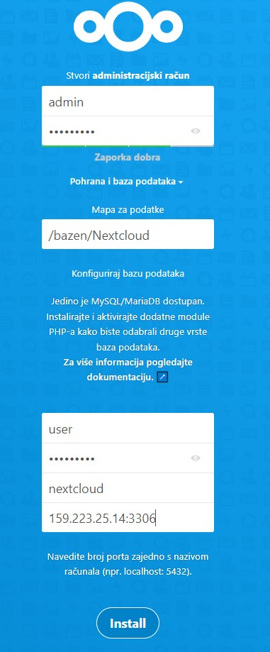

# Nexcloud

Nextcloud je paket klijentsko-poslužiteljskog softvera za stvaranje i korištenje usluga hostinga datoteka. Prilagođen je poduzeću s opsežnim opcijama podrške. Budući da je besplatan i softver otvorenog koda, svatko ga može instalirati i koristiti na vlastitim privatnim poslužiteljskim uređajima

## Zadatak

1. Konfigurirati balanser opterećenja te barem dvije instance web poslužitelja i PHP-a. Iskoristiti sustav za upravljanje bazom podataka po želji i konfigurirati dvije instance između kojih postoji replikacija; radi jednostavnosti, neka prvi web poslužitelj koristi prvu, a drugi drugu.
2. Sve zahtjeve na HTTP preusmjerite na HTTPS.
3. Direktorij u kojem se spremaju korisničke datoteke neka bude na ZFS mirroru
4. Konfigurirati backup baze podataka, datoteka postavljenih od strane korisnika i konfiguracijskih datoteka (systemd Timer i rsync).

## Uvod

U svrhu izrade projektnog zadtatka na [pružatelju infrastrukture u oblaku](https://en.wikipedia.org/wiki/DigitalOcean), [DigitalOcean](https://www.digitalocean.com/), kreirano je 5 virtualnih mašina s operacijskim sustavom Ubuntu 20.04 (LTS).

| Naziv             |     IPv4        |
| :---              |    :----:       |
| VM-Loadbalancer   | 46.101.210.184  |
| VM-Nextcloud-01   | 159.89.111.232  |
| VM-Nextcloud-02   | 159.65.113.57   |
| VM-MariaDB-01     | 159.223.25.14   |
| VM-MariaDB-02     | 164.92.224.104  |

## Instalacija i konfiguracija baze podataka

Na virtualnu mašinu **VM-MariaDB-01** možemo se povezati [OpenSSH-om](https://www.openssh.com/) korištenjem korisničkog imena `root` i zaporke koju smo postavili prilikom kreiranja VM-a na način:

```console
$ ssh root@159.223.25.14
The authenticity of host '159.223.25.14 (159.223.25.14)' can't be established.
ECDSA key fingerprint is SHA256:WPXVuY3w7NLYK8i5iCvhlZoygyg5eeMWchCqoOr2eoI.
Are you sure you want to continue connecting (yes/no/[fingerprint])? yes
Warning: Permanently added '159.223.25.14' (ECDSA) to the list of known hosts.
root@159.223.25.14's password:
```

Prije instalacije [MariaDB](https://mariadb.org/) baze podataka preuzimamo popise paketa iz spremišta te ih "ažuriramo" kako bi imali informacije o najnovijim verzijama paketa i njihovim ovisnostima.

```console
apt update && apt upgrade -y
apt install mariadb-server -y
```

Razvoj MariaDB-a započet je odvajanjem od [MySQL-a](https://www.mysql.com/) izvedenim od strane nekolicine izvornih programera MySQL-a zbog zabrinutosti oko njegove budućnosti povodom akvizicije Suna od strane Oraclea. Prvenstveni cilj stvaranja projekta neovisnog o Oracleu je želja da softvera ostane slobodan i otvorenog koda pod licencom GNU General Public License

Omogućujemo pokretanje servisa MariaDB pri pokretanju virtualne mašine naredbom:

```console
systemctl enable mariadb.service
```

Radi poboljšanja sigurnosti provest će se sigurnosna instalacija navedene baze podataka:

```console
$ mysql_secure_installation

NOTE: RUNNING ALL PARTS OF THIS SCRIPT IS RECOMMENDED FOR ALL MariaDB
      SERVERS IN PRODUCTION USE!  PLEASE READ EACH STEP CAREFULLY!

In order to log into MariaDB to secure it, we'll need the current
password for the root user.  If you've just installed MariaDB, and
you haven't set the root password yet, the password will be blank,
so you should just press enter here.

Enter current password for root (enter for none):
OK, successfully used password, moving on...

Setting the root password ensures that nobody can log into the MariaDB
root user without the proper authorisation.

Set root password? [Y/n] y
New password:
Re-enter new password:
Password updated successfully!
Reloading privilege tables..
 ... Success!


By default, a MariaDB installation has an anonymous user, allowing anyone
to log into MariaDB without having to have a user account created for
them.  This is intended only for testing, and to make the installation
go a bit smoother.  You should remove them before moving into a
production environment.

Remove anonymous users? [Y/n] y
 ... Success!

Normally, root should only be allowed to connect from 'localhost'.  This
ensures that someone cannot guess at the root password from the network.

Disallow root login remotely? [Y/n] y
 ... Success!

By default, MariaDB comes with a database named 'test' that anyone can
access.  This is also intended only for testing, and should be removed
before moving into a production environment.

Remove test database and access to it? [Y/n] y
 - Dropping test database...
 ... Success!
 - Removing privileges on test database...
 ... Success!

Reloading the privilege tables will ensure that all changes made so far
will take effect immediately.

Reload privilege tables now? [Y/n] y
 ... Success!

Cleaning up...

All done!  If you've completed all of the above steps, your MariaDB
installation should now be secure.

Thanks for using MariaDB!
```

Svi udaljeni pristupi poslužitelju prema zadanim postavkama se odbijaju. Omogućavanje udaljenog pristupa bazi podataka osigurat će se konfiguracijom datoteke `/etc/mysql/mariadb.conf.d/50-server.cnf`.

```console
nano /etc/mysql/mariadb.conf.d/50-server.cnf
```

U otvorenoj datoteci izmjenit će se parametar `bind-address` koji je defaultno postavljen na `127.0.0.1`. Također odkomentirati će se linija koja započinje riječju `port`. Navedene promjene obavezno trebaju biti pod **[mysqld]**. Niže je prikazan dio izmjenjene konfiguracijske datoteke `50-server.cnf`.

```cnf
[mysqld]
#
# * Basic Settings
#
user                    = mysql
pid-file                = /run/mysqld/mysqld.pid
socket                  = /run/mysqld/mysqld.sock
port                    = 3306
basedir                 = /usr
datadir                 = /var/lib/mysql
tmpdir                  = /tmp
lc-messages-dir         = /usr/share/mysql
#skip-external-locking

# Instead of skip-networking the default is now to listen only on
# localhost which is more compatible and is not less secure.
bind-address            = 0.0.0.0
```

Servis baze podataka resetiramo kako bi se napravljene promjene učitale te ćemo provjeriti socket sljedećom naredbom:

```console
$ systemctl restart mariadb.service
$ ss -tulpn | grep mysqld

Netid  State   Recv-Q  Send-Q     Local Address:Port     Peer Address:Port  Process
tcp    LISTEN   0      80           0.0.0.0:3306         0.0.0.0:*       users:(("mysqld",pid=29717,fd=21)) 
```

Sada je poslužitelj postavljen tako da sluša sve IP adrese, ali pojedinačna IP adresa mora biti eksplicitno konfigurirana za povezivanje s bazom podataka. Da bismo omogućili klijentu da se poveže s bazom podataka, moramo odobriti pristup udaljenom poslužitelju.

```console
$ mariadb
Welcome to the MariaDB monitor.  Commands end with ; or \g.
Your MariaDB connection id is 44
Server version: 10.3.34-MariaDB-0ubuntu0.20.04.1 Ubuntu 20.04

Copyright (c) 2000, 2018, Oracle, MariaDB Corporation Ab and others.

Type 'help;' or '\h' for help. Type '\c' to clear the current input statement.

MariaDB [(none)]> CREATE DATABASE IF NOT EXISTS nextcloud CHARACTER SET utf8mb4 COLLATE utf8mb4_general_ci;
Query OK, 1 row affected (0.000 sec)
```

```SQL
CREATE DATABASE IF NOT EXISTS nextcloud CHARACTER SET utf8mb4 COLLATE utf8mb4_general_ci;
GRANT ALL ON nextcloud.* TO 'user'@'159.89.111.232' IDENTIFIED BY 'password';
FLUSH PRIVILEGES;
EXIT;
```

Prikazani postupak odrađen je na **VM-MariaDB-01** virtualnoj mašini stoga je unesena adresa *`159.89.111.232`* odnosno IPv4 adresa **VM-Nextcloud-01** virtualne mašine. Postupak je potrebno ponoviti na **VM-MariaDB-02** unoseći IPv4 adresu **VM-Nextcloud-02**.

### Replikacija MariaDB

Konfigurirati će se shema Mater-Master replikacija baze podataka. U shemi Master-Master replikacije, bilo koji od MariaDB/MySQL poslužitelja baze podataka može se koristiti i za pisanje i čitanje podataka. Oba poslužitelja konfigurirati će se izmjenama u datoteci `/etc/mysql/mariadb.conf.d/50-server.cnf` u kojoj dodajemo sljedeće vrijednosti:

```console
$ nano /etc/mysql/mariadb.conf.d/50-server.cnf

server-id                   = X
report_host                 = masterX
log_bin                     = /var/log/mysql/mysql-bin.log
relay_log                   = /var/lib/mysql/relay-bin
relay_log_index             = /var/lib/mysql/relay-bin.index

log-slave-updates
auto_increment_increment    = 2
auto_increment_offset       = X
```

gdje je X = 1 za bazu podataka na prvom poslužitelju odnosno **VM-MariaDB-01**, a 2 za **VM-MariaDB-02**. Vrijednosti autoinkrementa znače da će u ID ćelijama jedan od mastera dobiti uvijek parne brojeve, a drugi uvijek neparne brojeve. Korisno kako bi se spriječilo da se isti identifikacijski broj dodijeli u oba mastera u isto vrijeme.

Resetiramo servis baze podataka kako bi se učitale nove vrijednosti.

```console
systemctl restart mariadb.service
```

Nadalje u bazu unosimo sljedeće:

```SQL
CREATE USER 'slave'@'%' IDENTIFIED BY 'tajnaL0zinka';
GRANT REPLICATION SLAVE ON *.* TO 'slave'@'%';
FLUSH PRIVILEGES;
```

Navedeno ponavljamo na **VM-MariaDB-02** izmjenjujući naziv korisnika u npr. **slave1**.

Prikazanom naredbom dobivamo informacije o masteru na **VM-MariaDB-01**, a trebamo ih kako bi omogućili *slave* način na **VM-MariaDB-02**.

```SQL
MariaDB [(none)]> SHOW MASTER STATUS;
+------------------+----------+--------------+------------------+
| File             | Position | Binlog_Do_DB | Binlog_Ignore_DB |
+------------------+----------+--------------+------------------+
| mysql-bin.000001 |      328 |              |                  |
+------------------+----------+--------------+------------------+
1 row in set (0.000 sec)
```

Konfiguriramo *slave* način na oba poslužitelja odnosno obe baze podataka. U bazi podataka na poslužitelju **VM-MariaDB-01** unosimo

```SQL
CHANGE MASTER TO MASTER_HOST='164.92.224.104', MASTER_USER='slave1', MASTER_PASSWORD='tajnaL0zinka', MASTER_LOG_FILE='mysql-bin.000001', MASTER_LOG_POS = 328;
START SLAVE;
```

dok na **VM-MariaDB-02** unosimo:

```SQL
CHANGE MASTER TO MASTER_HOST='159.223.25.14', MASTER_USER='slave',MASTER_PASSWORD='tajnaL0zinka', MASTER_LOG_FILE='mysql-bin.000001', MASTER_LOG_POS = 784;
START SLAVE;
```

## Preusmjeravanje zahtjeva s HTTP na HTTPS

Na virtualnu mašinu **VM-Loadbalancer** možemo se povezati [OpenSSH-om](https://www.openssh.com/) korištenjem korisničkog imena `root` i zaporke koju smo postavili prilikom kreiranja VM-a. Prije instalacije [Apache](https://httpd.apache.org/) web poslužitelja preuzimamo popise paketa iz spremišta te ih "ažuriramo" kako bi imali informacije o najnovijim verzijama paketa i njihovim ovisnostima.

```console
ssh root@46.101.210.184 
apt update && apt upgrade -y && install apache2 -y
```

Omogućavamo module `ssl` i `rewrite` naredbama:

```console
$ a2enmod ssl
mod rewriteConsidering dependency setenvif for ssl:
Module setenvif already enabled
Considering dependency mime for ssl:
Module mime already enabled
Considering dependency socache_shmcb for ssl:
Enabling module socache_shmcb.
Enabling module ssl.
See /usr/share/doc/apache2/README.Debian.gz on how to configure SSL and create self-signed certificates.
To activate the new configuration, you need to run:
  systemctl restart apache2

$ a2enmod rewrite
Enabling module rewrite.
To activate the new configuration, you need to run:
  systemctl restart apache2
```

Otvaramo konfiguracijsku datoteku `apache2.conf` i unosimo:

```console
$ nano /etc/apache2/apache2.conf

<Directory /var/www/html>
    AllowOverride All
</Directory>
```

Izrađujemo privatni ključ i certifikat web-mjesta pomoću naredbe OpenSSL.

```console
$ mkdir /etc/apache2/certificate
$ cd /etc/apache2/certificate
$ openssl req -new -newkey rsa:4096 -x509 -sha256 -days 365 -nodes -out apache-certificate.crt -keyout apache.key

Generating a RSA private key
...................................................++++
.....++++
writing new private key to 'apache.key'
-----
You are about to be asked to enter information that will be incorporated
into your certificate request.
What you are about to enter is what is called a Distinguished Name or a DN.
There are quite a few fields but you can leave some blank
For some fields there will be a default value,
If you enter '.', the field will be left blank.
-----
Country Name (2 letter code) [AU]:HR
State or Province Name (full name) [Some-State]:Croatia
Locality Name (eg, city) []:Zagreb
Organization Name (eg, company) [Internet Widgits Pty Ltd]:
Organizational Unit Name (eg, section) []:
Common Name (e.g. server FQDN or YOUR name) []:46.101.210.184
Email Address []:jlukin@student.uniri.hr
```

Otvaramo konfiguracijsku datoteku `apache2.conf`

```console
nano /etc/apache2/sites-enabled/000-default.conf
```

i dodajemo:

```cnf
<VirtualHost *:80>
        ...

        RewriteEngine On
        RewriteCond %{HTTPS} !=on
        RewriteRule ^/?(.*) https://%{SERVER_NAME}/$1 [R=301,L]

        ...
</virtualhost>

<VirtualHost *:443>
        ServerAdmin webmaster@localhost
        DocumentRoot /var/www/html
        ErrorLog ${APACHE_LOG_DIR}/error.log
        CustomLog ${APACHE_LOG_DIR}/access.log combined
        SSLEngine on
        SSLCertificateFile /etc/apache2/certificate/apache-certificate.crt
        SSLCertificateKeyFile /etc/apache2/certificate/apache.key
</VirtualHost>
```

Ponovno pokrećemo apache servis:

```console
$ systemctl restart apache2.service
$ systemctl status apache2.service

apache2.service - The Apache HTTP Server
     Loaded: loaded (/lib/systemd/system/apache2.service; enabled; vendor preset: enabled)
     Active: active (running) since Wed 2022-03-23 00:58:49 UTC; 15s ago
       Docs: https://httpd.apache.org/docs/2.4/
    Process: 18483 ExecStart=/usr/sbin/apachectl start (code=exited, status=0/SUCCESS)
   Main PID: 18497 (apache2)
      Tasks: 55 (limit: 1132)
     Memory: 5.7M
     CGroup: /system.slice/apache2.service
             ├─18497 /usr/sbin/apache2 -k start
             ├─18498 /usr/sbin/apache2 -k start
             └─18499 /usr/sbin/apache2 -k start
```

## Balansiranje opterećenja

Potrebna su nam četiri Apache modula za konfiguraciju Apache balansera opterećenja – `mod_proxy`, `mod_proxy_http`, `mod_proxy_balancer`, `mod_lbmethod_byrequests`. Omogućavamo navedene module naredbama:

```console
a2enmod proxy
a2enmod proxy_http
a2enmod proxy_balancer
a2enmod lbmethod_byrequests
```

Izmjenjujemo Apacheovu zadanu konfiguracijsku datoteku `000-default.conf` kako bismo konfigurirali Apacheov balanser opterećenja.

```console
nano /etc/apache2/sites-available/000-default.conf
```

U otvorenu datoteku pod `<VirtualHost *:443>` dodajemo sljedeće:

```conf
<Proxy balancer://mycluster>
    BalancerMember http://159.89.111.232
    BalancerMember http://159.65.113.57
</Proxy>
ProxyPreserveHost On
ProxyPass / balancer://mycluster/
ProxyPassReverse / balancer://mycluster/
```

Kako bi učitali napravljene promjene, resetiramo apache2 servis naredbom:

```console
service apache2 restart
```

## ZFS mirror

Prije kreiranja [ZFS](https://docs.oracle.com/cd/E19253-01/819-5461/zfsover-2/) mirrora, virtualnim mašinama **VM-Nextcloud-01** i **VM-Nextcloud-02** dodat će se dodatni memorijski prostor preko DigitalOcean web sučelja. Radi se o dva diska od kojih svaki ima 10GB prostora za pohranu podataka. Usporedbe radi prikazat će se output naredbe `fdisk -l` prije i nakon dodavanja spomenutih diskova.

```console
$ fdisk -l
Disk /dev/vda: 25 GiB, 26843545600 bytes, 52428800 sectors
Units: sectors of 1 * 512 = 512 bytes
Sector size (logical/physical): 512 bytes / 512 bytes
I/O size (minimum/optimal): 512 bytes / 512 bytes
Disklabel type: gpt
Disk identifier: F939C69C-B7F6-4E7D-90FC-BD42C215FA09

Device      Start      End  Sectors  Size Type
/dev/vda1  227328 52428766 52201439 24.9G Linux filesystem
/dev/vda14   2048    10239     8192    4M BIOS boot
/dev/vda15  10240   227327   217088  106M EFI System

Partition table entries are not in disk order.


Disk /dev/vdb: 466 KiB, 477184 bytes, 932 sectors
Units: sectors of 1 * 512 = 512 bytes
Sector size (logical/physical): 512 bytes / 512 bytes
I/O size (minimum/optimal): 512 bytes / 512 bytes
```

```console
$ fdisk -l
Disk /dev/vda: 25 GiB, 26843545600 bytes, 52428800 sectors
Units: sectors of 1 * 512 = 512 bytes
Sector size (logical/physical): 512 bytes / 512 bytes
I/O size (minimum/optimal): 512 bytes / 512 bytes
Disklabel type: gpt
Disk identifier: F939C69C-B7F6-4E7D-90FC-BD42C215FA09

Device      Start      End  Sectors  Size Type
/dev/vda1  227328 52428766 52201439 24.9G Linux filesystem
/dev/vda14   2048    10239     8192    4M BIOS boot
/dev/vda15  10240   227327   217088  106M EFI System

Partition table entries are not in disk order.


Disk /dev/vdb: 466 KiB, 477184 bytes, 932 sectors
Units: sectors of 1 * 512 = 512 bytes
Sector size (logical/physical): 512 bytes / 512 bytes
I/O size (minimum/optimal): 512 bytes / 512 bytes


Disk /dev/sda: 10 GiB, 10737418240 bytes, 20971520 sectors
Disk model: Volume
Units: sectors of 1 * 512 = 512 bytes
Sector size (logical/physical): 512 bytes / 512 bytes
I/O size (minimum/optimal): 512 bytes / 512 bytes


Disk /dev/sdb: 10 GiB, 10737418240 bytes, 20971520 sectors
Disk model: Volume
Units: sectors of 1 * 512 = 512 bytes
Sector size (logical/physical): 512 bytes / 512 bytes
I/O size (minimum/optimal): 512 bytes / 512 bytes
root@VM-Nextcloud-01:~#
```

Na virtualnu mašinu **VM-Nextcloud-01** možemo se povezati [OpenSSH-om](https://www.openssh.com/) korištenjem korisničkog imena `root` i zaporke koju smo postavili prilikom kreiranja VM-a. Prije instalacije `zfsutils-linux` web poslužitelja preuzimamo popise paketa iz spremišta te ih "ažuriramo" kako bi imali informacije o najnovijim verzijama paketa i njihovim ovisnostima.

```console
ssh root@159.89.111.232
apt update && apt upgrade -y
apt install zfsutils-linux -y
```

Kreirat će se ZFS mirror pool od dva diska locirana na `/dev/sda` i `/dev/sdb` te provjeriti status naredbama:

```console
$ zpool create bazen mirror /dev/sda /dev/sdb
$ zpool status

  pool: bazen
 state: ONLINE
  scan: none requested
config:

        NAME        STATE     READ WRITE CKSUM
        bazen       ONLINE       0     0     0
          mirror-0  ONLINE       0     0     0
            sda     ONLINE       0     0     0
            sdb     ONLINE       0     0     0

errors: No known data errors
```

Kako bi saznali mountpoint koristimo se naredbom:

```console
$ zfs get mountpoint

NAME   PROPERTY    VALUE       SOURCE
bazen  mountpoint  /bazen      default

$ zfs get mounted

NAME   PROPERTY  VALUE    SOURCE
bazen  mounted   yes      -
```

Kreira se poseban direktorij `/bazen/Nextcloud` za pohranu korisničkih podataka naredbom:

```console
zfs create bazen/Nextcloud
```

Sve navedeno potrebno je provesti na virtualnoj mašini **VM-Nextcloud-02**.

## Nextcloud instalacija

Prije same instalacije aplikacije preuzimaju se potrebni i preporučeni moduli za tipičnu Nextcloud instalaciju.

```console
apt install apache2 libapache2-mod-php7.4 php7.4-gd php7.4-mysql php7.4-curl php7.4-mbstring php7.4-intl php7.4-gmp php7.4-bcmath php-imagick php7.4-xml php7.4-zip -y
```

Zatim preuzimamo samu aplikaciju sa službenih stranica [Nextcloud-a](https://nextcloud.com/).

```console
wget https://download.nextcloud.com/server/releases/nextcloud-23.0.2.tar.bz2
```

Raspakirajmo preuzetu datoteku u direktorij `/var/www`.

```console
tar -xjf nextcloud-23.0.2.tar.bz2 -C /var/www
```

Kreiramo novu konfiguracijsku datoteku `nextcloud.conf`

```console
nano /etc/apache2/sites-available/nextcloud.conf
```

Pošto Nextcloud instaliramo u već postojeći web poslužitelj odnosno koristimo se  *directory-based* instalacijom unosimo sljedeće:

```cnf
Alias /nextcloud "/var/www/nextcloud/"

<Directory /var/www/nextcloud/>
  Require all granted
  AllowOverride All
  Options FollowSymLinks MultiViews

  <IfModule mod_dav.c>
    Dav off
  </IfModule>
</Directory>
```

Nadalje omogućujemo navedenu konfiguraciju poslužitelju i mijenjamo vlasništvo datoteke na korisnika i grupu *www-data* te omogućujemo pristup za čitanje i izvršavanje za svakog korisnika te pristup za pisanje samo za vlasnika direktorija `bazen/Nextcloud`

```console
chown -R www-data:www-data /bazen/Nextcloud
chmod -R 755 /bazen/Nextcloud
a2ensite nextcloud.conf
```

Prije pristupa aplikaciji resetirat ćemo poslužitelja:

```console
systemctl restart apache2
```

Pristupimo serveru preko lokalnog preglednika unoseći `IP adresu/nextcloud` u [URL](https://hr.wikipedia.org/wiki/URL). Unosimo podatke o administratorskom računu koji će se kreirati tijekom instalacija, lokaciju direktorija koji će služiti za pohranu korisničkih podataka, korisnika i lozinku za pristup bazi podataka kao i naziv tablice u bazi podataka. Na kraju dodajemo IPv4 adresu poslužitelja s bazom podataka. Za **VM-Nextcloud-01** je to adresa **VM-MariaDB-01**.



Kako bi Nexcloud aplikaciji mogli pristupiti preko balansera opterećenja, potrebno je dodati IP adresu, u ovom slučaju `46.101.210.184` u konfiguracijsku datoteku `config.php` odnosno dodati domanu u **trusted_domains**. Konfiguracijska datoteka treba izgledati otprilike ovako:

```console
$ cat /var/www/nextcloud/config/config.php

<?php
$CONFIG = array (
  'instanceid' => 'ocovz4js1fid',
  'passwordsalt' => 'geu4tIZ5TARCCiALHTs0ysxUCqaNU1',
  'secret' => 'DAsRW9lS28KY04jl/Y3bGT71WcBOp3fV82V4SGsj5/aDe+d1',
  'trusted_domains' =>
  array (
    0 => '159.89.111.232',
    1 => '46.101.210.184',
  ),
  'datadirectory' => '/bazen/Nextcloud',
  'dbtype' => 'mysql',
  'version' => '23.0.2.1',
  'overwrite.cli.url' => 'http://159.89.111.232/nextcloud',
  'dbname' => 'nextcloud',
  'dbhost' => '159.223.25.14:3306',
  'dbport' => '',
  'dbtableprefix' => 'oc_',
  'mysql.utf8mb4' => true,
  'dbuser' => 'user',
  'dbpassword' => 'tajnaL0zinka',
  'installed' => true,
);

```

Sve navedeno potrebno je provesti na virtualnoj mašini **VM-Nextcloud-02**.

## Backup

### MariaDB

Na virtualnu mašinu **VM-MariaDB-01** možemo se povezati [OpenSSH-om](https://www.openssh.com/) korištenjem korisničkog imena `root` i zaporke koju smo postavili prilikom kreiranja VM-a. Postaviti će se dnevno backup-iranje baze podataka. Nakon povezivanja preuzet će se [mariabackup](https://mariadb.com/kb/en/mariabackup-overview/) na sljedeći naćin:

```console
apt install mariadb-backup
```

Kreiramo direktorij u kojem će se pohranjivati backup baze podataka:

```console
mkdir mariaDB_backup
```

Kreirat će se skripta koja će obavljati backup MariaDB baze podataka na sljedeći način:

```console
nano backupMariaDB.sh
```

U novokreiranu skriptu unosi se:

```sh
#!/bin/bash

mariabackup --backup --rsync -u root -p[tajnal0zinka] --target-dir=/root/mariaDB_backup/$(date +"%m-%d-%Y")
```

Pokretanjem ove skripte pohranit će se backup baze podataka u diretkorij naziva `MM-DD-YYYY`. Nadalje, premještamo se u direktorij `/etc/systemd/system/` i kreiramo datoteke `backupMariaDB.service` i `backupMariaDB.timer` na sljedeći način:

```console
cd /etc/systemd/system/
nano backupMariaDB.service
nano backupMariaDB.timer
```

Novokreirani servis i timer konfigurirat će se tako da izgledaju kao niže prikazano.

```console
$ cat backupMariaDB.service
[Unit]
Description = Daily backup of MariaDB

[Service]
Type=oneshot
ExecStart=/bin/bash /root/backupMariaDB.sh
```

```console
$ cat backupMariaDB.timer
[Unit]
Description= Daily backup of MariaDb
Requires=backupMariaDB.service

[Timer]
Persistent=true
OnCalendar = daily

[Install]
WantedBy=timers.target
```

Zatim učitavamo konfiguraciju [systemd](https://www.freedesktop.org/wiki/Software/systemd/) upravitelja i omogućujemo timer na startup-u te provjeravamo status timera.

```console
$ systemctl daemon-reload
$ systemctl enable backupMariaDB.timer
Created symlink /etc/systemd/system/timers.target.wants/backupMariaDB.timer → /etc/systemd/system/backupMariaDB.timer.

$ systemctl status backupMariaDB.timer
● backupMariaDB.timer - Hourly backup of MariaDb
     Loaded: loaded (/etc/systemd/system/backupMariaDB.timer; enabled; vendor preset: enabled)
     Active: active (waiting) since Wed 2022-03-23 19:39:03 UTC; 49min ago
    Trigger: Thu 2022-03-24 00:00:00 UTC; 3h 31min left
   Triggers: ● backupMariaDB.service
```

Sve navedeno potrebno je provesti na virtualnoj mašini **VM-MariaDB-02**.

### Korisničke datoteke

Na virtualnu mašinu **VM-Nextcloud-01** povežemo se [OpenSSH-om](https://www.openssh.com/) korištenjem korisničkog imena `root` i zaporke koju smo postavili prilikom kreiranja VM-a. Kreirat će se skripta koja će obavljati backup.

```console
nano backupNextcloud.sh
```

U skriptu se unosi:

```console
#!/bin/bash

rsync -av --delete  /bazen/Nextcloud/ /home/backupNextcloud
```

Nadalje, premještamo se u direktorij `/etc/systemd/system/` i kreiramo datoteke `backupNextcloud.service` i `backupNextcloud.timer`:

```console
cd /etc/systemd/system/
nano backupNextcloud.service
nano backupNextcloud.timer
```

Novokreirane datoteke konfigurirat će se tako da izgledaju kao niže prikazano.

```console
$ cat backupNextcloud.service
[Unit]
Description = Daily backup of Nextcloud files

[Service]
Type=oneshot
ExecStart=/bin/bash /root/backupNextcloud.sh
```

```console
$ cat backupNextcloud.timer
[Unit]
Description= Daily backup of Nextcloud files
Requires=backupNextcloud.service

[Timer]
Persistent=true
OnCalendar = daily

[Install]
WantedBy=timers.target
```

Zatim učitavamo konfiguraciju [systemd](https://www.freedesktop.org/wiki/Software/systemd/) upravitelja i omogućujemo timer na startup-u te provjeravamo status servisa.

```console
$ systemctl daemon-reload
$ systemctl enable backupNextcloud.timer
Created symlink /etc/systemd/system/timers.target.wants/backupNextcloud.timer → /etc/systemd/system/backupNextcloud.timer.

$ systemctl status backupNextcloud.service
● backupNextcloud.service - Daily backup of Nextcloud files
     Loaded: loaded (/etc/systemd/system/backupNextcloud.service; static; vendor preset: enabled)
     Active: inactive (dead) since Wed 2022-03-23 20:44:34 UTC; 22s ago
TriggeredBy: ● backupNextcloud.timer
   Main PID: 66874 (code=exited, status=0/SUCCESS)
```

Sve navedeno potrebno je provesti na virtualnoj mašini **VM-Nextcloud-02**.
